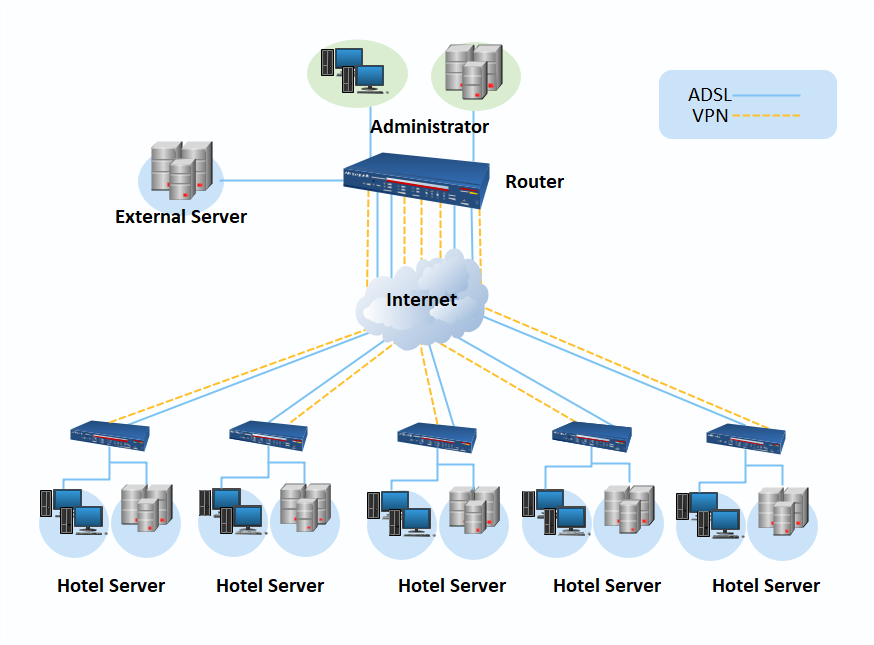
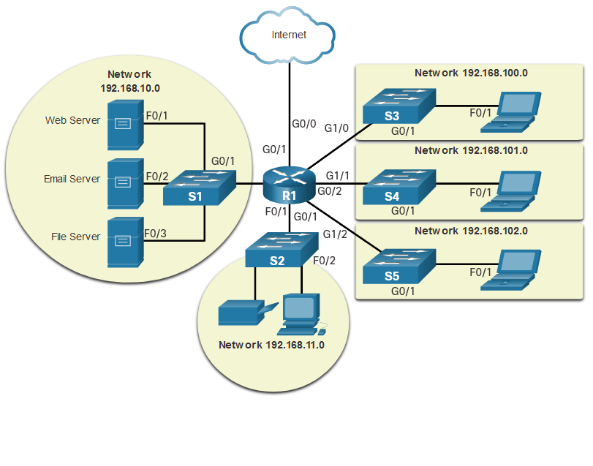
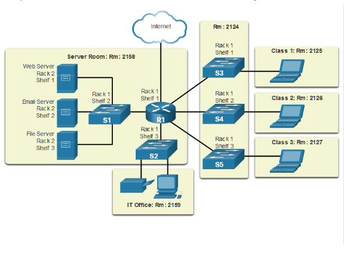
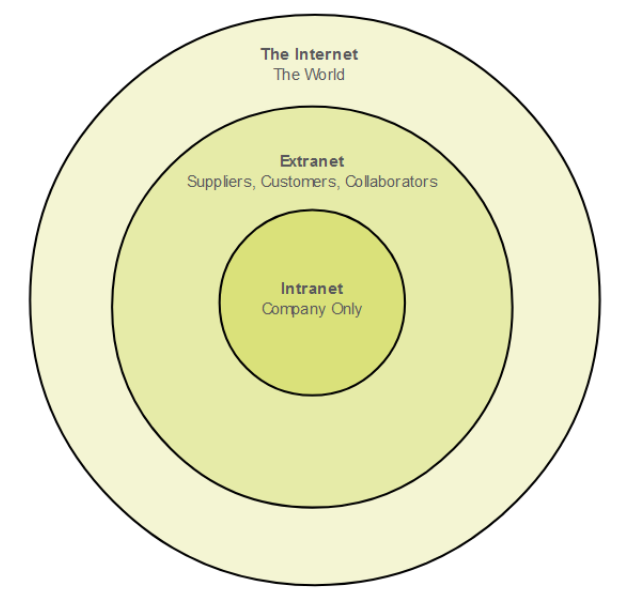
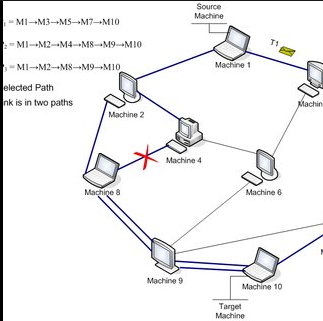

# Networks Today

* #### End Devices - A source or destination device in a networked system
* #### Intermediary Devices - Devices which connect the individual hosts to the network and can connect from multiple individual networks to form an internetwork
* #### Network Media - Communication channels used to interconnect nodes on the computer network

# Topology Diagrams

A `Network Topology Diagrams` is a visual representation of a network's devices, connections, and paths, allowing to picutre how devices are interconnected and how they communicate with one another.

- `Logical Topology Diagram`:
Logical topology Diagrams are focused on the way data connections work across the computer network and can reveal how devices communicate with each other.

- `Physical Topology Diagram`:
A physical network diagram depicts the network topology with the physical aspects like ports, cabels, racks and more.

# Network Types

* Home Networks: A group of devices - such as computers, game systems, printers, and mobile devices - that connected to the Internet and each other.
* Small office and home office (SOHO): It allows computers in a home office or remote office to connect to a corporate network, or access centralized, shared resources
* Businesses and large organizations: use networks to provide storage, and access to information on network servers. Provide email, instant messaging, and collaboration among employees. 
* The Internet: It is a worldwide system of computer networks. Also known as "the Net"

# LANS and WANS
* LAN : a collection of devices connected together in one physical location, such as a building, office, or home
* WAN : the technology that connects your offices, data centers, cloud applications, and cloud storage together

The Internet is a worldwide collection of interconnected networks - i.e. it is a collection of interconnected LANs and WANs

# Intranet and Extranet 
* An Intranet is a private network within an enterprise used to share company information and computing resources among employees
* An Extranet is a private network similar to an interanet, but its typically open to external parties, such as business partners, suppliers, key customers etc

# Internet Connections

* WiFi
* Boardband
* DSL
* Cable

# Converged Network
The geographical area covered by the network of a service provider. Traditionally communication networks are composed by disceret system which is certain service are responsible for broadcasting certain feature. However currently a `morden coverged network` can broadcaste multiple services.

# Network Architecture
It refers to the way network devices and services are structured to server the connectivity needs of client devices.

* Types of Network Architectures
    - P2P (Peer-to-peer)
    - Client/Server 
    
* Basic characterstics of the network architects
    - Fault Tolerance
    - Scalability
    - Quality of service (QOS)
    - Security

* Fault Tolerance
It is a process that enables an operating system to respond to a faliure in hardware or software. A fault tolerant network is one that limits the number of affected devices during a device faliure.
It is built to allow quick recovery when such a failure occurs. These networks depends on multiple paths between source and destination. If one of the paths fails the data is sent over a different link or device. Having multiple paths/devices to a destination is known as redundancy.

